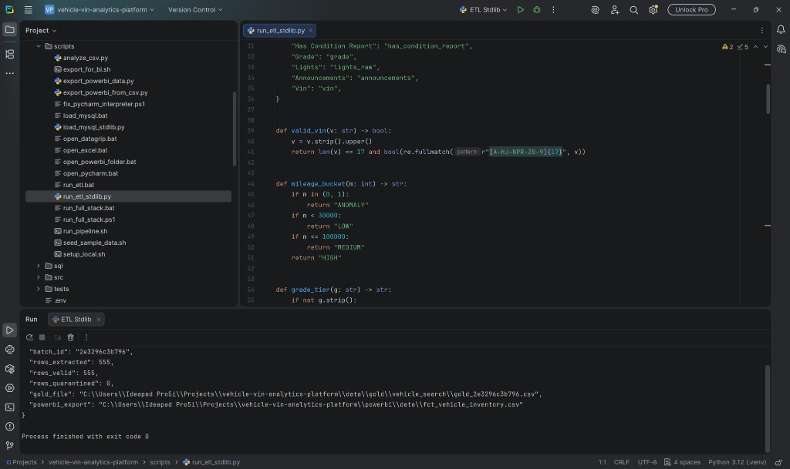
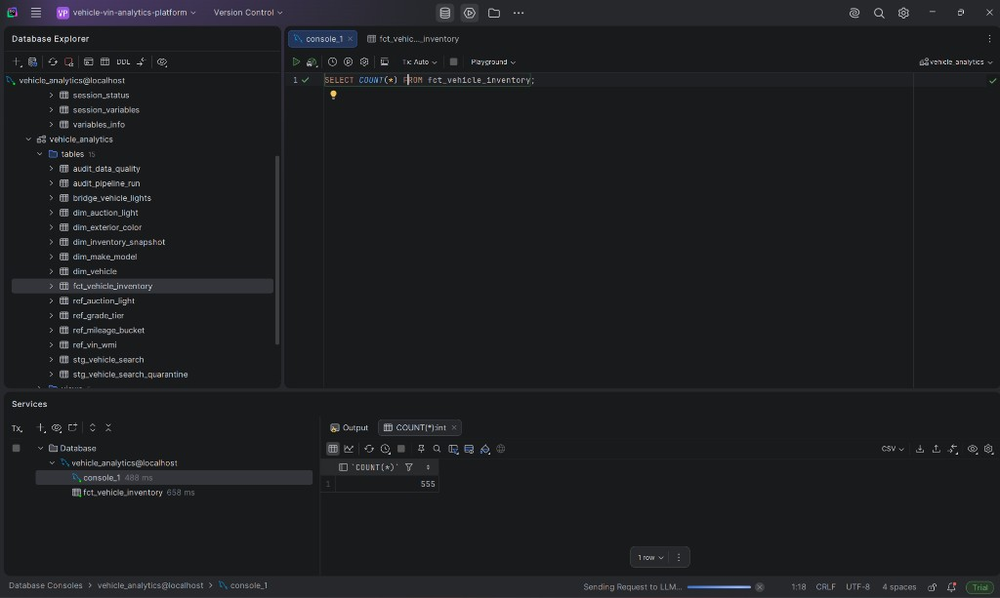
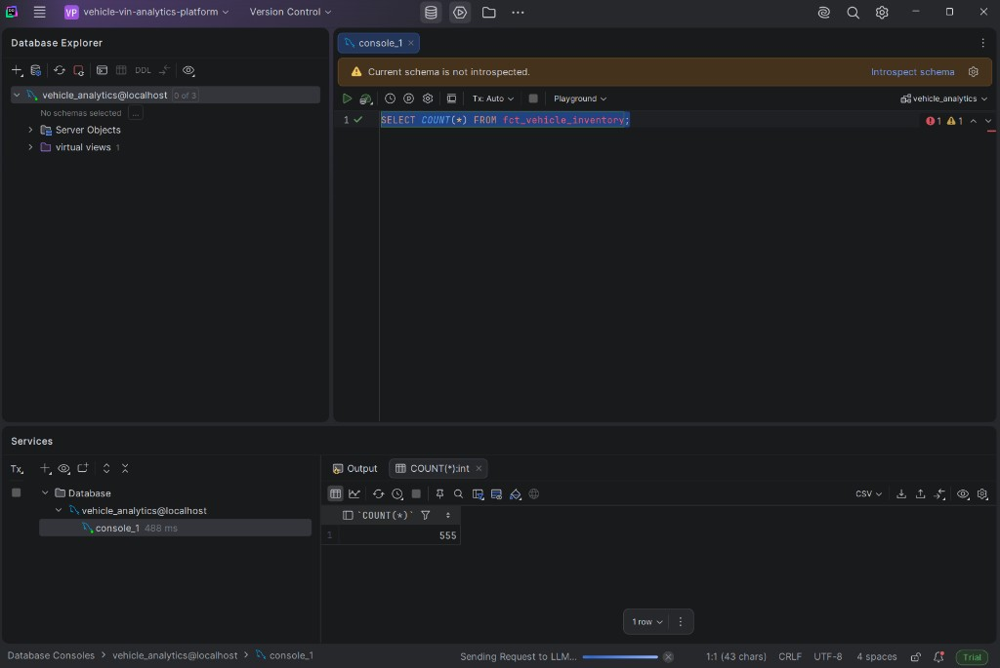

# VIN Intelligence & Car Market Analytics Platform

Production-ready end-to-end data engineering portfolio project for **BMW wholesale auction inventory** analytics.

[](https://www.python.org/downloads/)
[](https://www.mysql.com/)
[](powerbi/)

---

## Overview

This platform ingests vehicle auction CSV data (VIN, grade, mileage, condition signals), validates and transforms it through a **medallion ETL pipeline**, loads it into a **MySQL star schema**, and serves **SQL analytics**, **Excel reports**, and **Power BI dashboards**.

```
CSV → ETL (Python) → MySQL → SQL / Excel / Power BI
         ↓
    Bronze / Silver / Gold (local files)
```

### Dataset

| Attribute | Value |
|-----------|-------|
| Source | Edge Pipeline Vehicle Search |
| Records | 555 BMW vehicles |
| Key | VIN (17-char, unique) |
| Quality proxy | Grade (0–5), Lights, Condition Report |

> **Note:** Price, fuel type, and dealer geography are **not** in the source CSV. Analytics use Grade and Mileage as market-quality proxies.

---

## Project Structure

```
vehicle-vin-analytics-platform/
├── etl/                    # Python ETL pipeline (pandas, sqlalchemy, pymysql)
├── sql/
│   ├── ddl/mysql/          # MySQL star schema DDL
│   └── analytics/          # Business SQL queries (CTEs, windows)
├── excel/                  # Excel workbook generator
├── powerbi/                # Star schema, DAX measures, dashboard specs
├── data/                   # Medallion layers (raw → gold)
├── docs/
│   ├── analysis/           # Data profiling
│   ├── insights/           # 20 business insights
│   └── screenshots/        # Dashboard screenshots (placeholders)
├── tests/                  # Unit tests
├── docker-compose.yml      # MySQL 8 local warehouse
└── requirements.txt
```

---

## Deployment Workflow

```
ETL → DB (MySQL) → Power BI → Docker/MySQL → GitHub
```

### One-command (Windows)

```powershell
.\scripts\run_full_stack.ps1
```

Or double-click: `scripts\run_full_stack.bat`

### Step-by-step

| Step | Command | Output |
|------|---------|--------|
| **1. ETL** | `python scripts/run_etl_stdlib.py` | `data/gold/`, `powerbi/data/fct_vehicle_inventory.csv` |
| **2. DB** | `docker compose up -d` then `set LOAD_TO_MYSQL=true && python -m etl` | MySQL star schema populated |
| **3. Power BI** | Import `powerbi/data/fct_vehicle_inventory.csv` | See `powerbi/IMPORT_GUIDE.md` |
| **4. Docker** | `docker compose up -d` | MySQL on `localhost:3306` |
| **5. GitHub** | See `docs/github-setup.md` | Push to remote |

### Current run status

ETL stdlib pipeline executed: **555 rows** → `powerbi/data/fct_vehicle_inventory.csv` ready for Power BI.


```bash
cd vehicle-vin-analytics-platform
python -m venv .venv
.venv\Scripts\activate        # Windows
pip install -r requirements.txt
pip install -e .
```

### 2. Start MySQL

```bash
docker compose up -d
```

DDL scripts auto-apply on first container start (`sql/ddl/mysql/`).

### 3. Place source CSV

Copy your CSV to:

```
data/raw/vehicle_search/edge_pipeline_vehicle_search_2026-06-09.csv
```

### 4. Run ETL

```bash
# File layers only
python -m etl

# Load into MySQL
set LOAD_TO_MYSQL=true
python -m etl
```

### 5. Generate Excel report

```bash
python excel/generate_workbook.py
```

### 6. Power BI

Connect to `localhost:3306` / `vehicle_analytics` — see [powerbi/star-schema.md](powerbi/star-schema.md).

---

## Documentation

| Document | Description |
|----------|-------------|
| [Installation Guide](docs/installation.md) | Full setup instructions |
| [Data Profile](docs/analysis/full-data-profile.md) | Phase 1 analysis |
| [MySQL Schema](docs/data-dictionary/mysql-schema.md) | Star schema design |
| [Business Insights](docs/insights/business-insights.md) | 20 actionable insights |
| [SQL Analytics](sql/analytics/README.md) | Query catalog |
| [Power BI](powerbi/dashboard-pages.md) | 5-page dashboard spec |
| [Architecture](docs/architecture/system-overview.md) | System design |

---

## Tech Stack

| Layer | Technology |
|-------|------------|
| ETL | Python, pandas, numpy, sqlalchemy, pymysql |
| Warehouse | MySQL 8.0 |
| Analytics | SQL (CTEs, window functions) |
| Reporting | Excel (openpyxl), Power BI |
| Infrastructure | Docker Compose |
| Testing | pytest |

---

## Key Features

- VIN validation (format, uniqueness, quarantine)
- Medallion architecture (bronze / silver / gold)
- Star schema with SCD Type 2 vehicle dimension
- Anomaly detection (mileage IQR, grade outliers)
- Derived flags from announcements (AS IS, structural, salvage)
- Auction light bridge table (multi-value lights)
- 10 production SQL analytics queries
- Power BI star schema + DAX measures

---

## Screenshots

### Pipeline (Python + MySQL)

| Step | Screenshot |
|------|------------|
| PyCharm ETL Run (`rows_valid: 555`) |  |
| DataGrip star schema (15 tables) |  |
| MySQL row count verification |  |

### Power BI

Dashboard specs, DAX, and import guides live in [`powerbi/`](powerbi/).  
Screenshots of `.pbix` pages are kept locally for thesis — not committed to Git.

---

## Author

Portfolio project — Data Engineering & Analytics

## License

MIT
